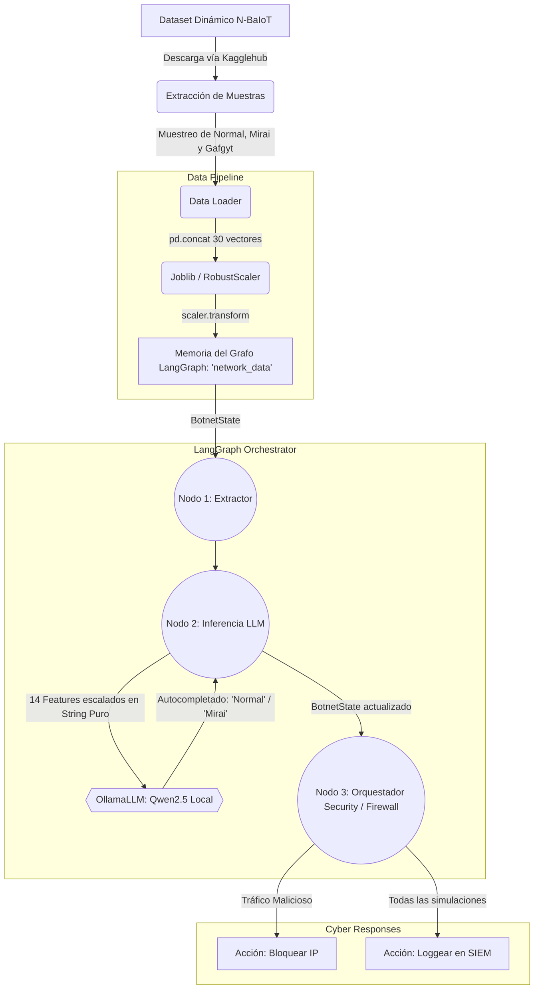

# Framework LangGraph-Qwen2.5 para Detección de Botnets IoT

## 📝 Resumen del Proyecto

Este proyecto implementa una arquitectura automatizada de ciberseguridad para redes IoT, combinando Inteligencia Artificial Generativa y flujos de trabajo basados en grafos. Específicamente, utilizamos **LangGraph** como motor de orquestación y un modelo Small Language Model (SLM) local finamente ajustado (**Qwen2.5** en formato GGUF) operado a través de **Ollama**. El objetivo es clasificar flujos de tráfico de red y detectar comportamientos anómalos derivados de infecciones por botnets IoT conocidas, como **Mirai** y **Gafgyt**.

A diferencia de los modelos de Machine Learning tradicionales (como Random Forest o SVM), aquí el SLM razona directamente sobre métricas numéricas. A través de un escalado idéntico al de su entrenamiento, el framework evalúa el tráfico y detona acciones defensivas simuladas (bloqueos en el firewall o alertamiento en un panel SIEM) de forma autónoma.

## 🏛️ Diagrama de Arquitectura Actual 



### Explicación del Flujo
1. **Pipeline de Datos**: El script selecciona aleatoriamente registros desde los CSV crudos de Kaggle. Antes de que LangGraph analice los datos, el preprocesador utiliza un `RobustScaler` (exportado previamente como archivo `.pkl` del entrenamiento base) e inyecta la normalidad matemática necesaria para las 14 features vectoriales seleccionadas.
2. **Inyección Cero-Alucinaciones**: En el nodo de inferencia, LangChain entra en juego exclusivamente encapsulando a Ollama a través de `OllamaLLM` (Text Completion Puro). Los 14 datos se formatean en cadenas estáticas con guiones e iteraciones idénticas a las del proceso de *Fine-Tuning* para asegurar una precisión impecable.
3. **Mecanismos de Reacción**: El tercer nodo del framework de LangGraph usa el dictamen y dependiendo del resultado (si es benigno o malicioso) manda llamar funciones lógicas (tools) que simularían interactuar con las reglas de ingreso perimetral de la red (Mock-Firewall).

---

## 📂 Organización Modular de los Archivos

El repositorio está fuertemente estructurado para separar responsabilidades. En términos generales:

* **evaluate.py**: Es el motor principal del proyecto. Ensambla y ejecuta todo el grafo pasándole datos reales e imprime finalmente los resultados (matriz de confusión y reportes).
* **main.py**: Constituye una versión primaria/primitiva o de pruebas singulares (basada en valores sintéticos en duro) sin utilizar todo el dataset complejo.
* **grafica.py**: Herramienta analítica satélite que arroja comparativas entre las calidades y realismos de los datasets de IoT que validan a *N-BaIoT* como referente.
* **requirements.txt**: Reúne el entorno de dependencias exacto que permite recrear el espacio (Pandas, Scikit-learn, Langchain, etc).

La lógica de negocio se divide en carpetas clave:

* **/data/processed/**: Repositorio gráfico donde se almacenarán las métricas y la Matriz de Confusión en formato `.png` derivado de las conclusiones de `evaluate.py`.
* **/modelos_entrenados/**: Guarda estrictamente el cerebro del bot. Albergará al modelo `qwen2.5_botnet.gguf`, el archivo de pesos `robust_scaler.pkl` exportado para el escalamiento y el `Modelfile`. *El Modelfile* gobierna en tiempo real sobre cómo Ollama enmarca el prompt interno (instruyendo que siempre finalice con `Trafico: ` garantizando la reacción inmediata del modelo).
* **/src/utils/**: Esconde el pipeline ETL (`data_loader.py`) que usa una lista filtrada de las 14 variables de red más reveladoras tras la optimización matemática para aplicar el `transformer`.
* **/src/models/**: Ubicación del script de interconexión API local (`model_loader.py`) quien crea y establece las variables para invocar al Qwen2.5 por la IP en el puerto 11434.
* **/src/graph/**: El lugar donde ocurre la magia transitoria. En `state.py` definimos el diccionario (la memoria) que fluye entre cada paso, en `workflow.py` construimos el compilado lineal general, y en `nodes.py` declaramos las lógicas aisladas que se alimentarán entre sí secuencialmente. 
* **/src/tools/**: El cajón de herramientas lógicas ejecutables (`firewall_actions.py`) que imitan de manera visual/textual una integración real SOC/Gobernanza hacia las interfaces defensivas perimetrales.

---

## 🚀 Requisitos y Ejecución 

Asegúrese de cargar las librerías base necesarias primero:
```powershell
pip install -r requirements.txt
```

Al existir modificaciones arquitectónicas importantes o la descarga reciente de su `.gguf` asegure que su contenedor virtual de Ollama absorba la nueva regla (Modelfile) ejecutando desde `/modelos_entrenados/`:
```powershell
ollama create qwen2.5_botnet -f Modelfile
```

Posteriormente, con la orquestación y el scaler debidamente ubicados, dispare desde su raíz base el archivo evaluativo:
```powershell
python evaluate.py
```
